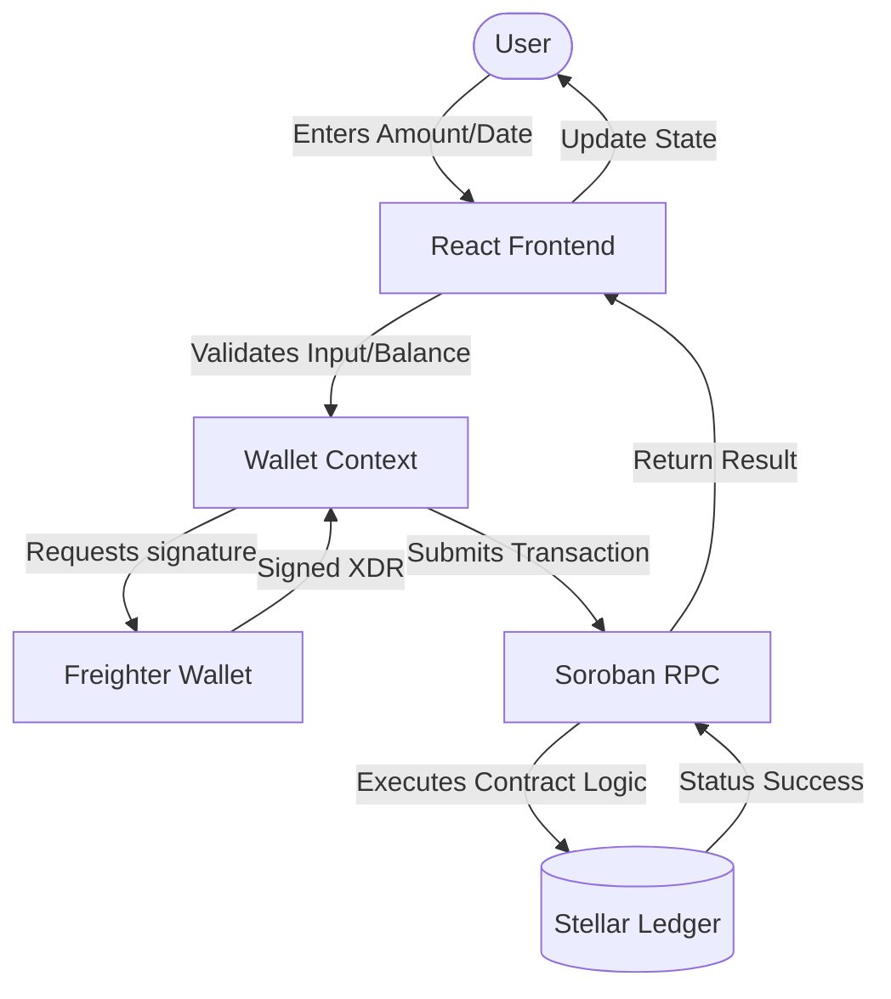

# PayDrip System Architecture 🏗️

This document outlines the architectural design and data flow of PayDrip, a production-grade decentralized payment scheduler on the Stellar network.

## 1. System Overview

PayDrip is built as a **Decentralized Application (dApp)** that bridges high-performance fintech UI with the security of the **Stellar Soroban** smart contract ecosystem.

- **Frontend**: React + Vite (Single Page Application)
- **State Management**: React Context (Wallet, App, and Toast states)
- **Blockchain**: Stellar Testnet
- **Smart Contracts**: Soroban (Rust SDK v22)
- **Wallet Integration**: Freighter API (Browser Extension)

## 2. Component Breakdown

### 📱 UI Components (`/src/components`)
- **Navigation**: Responsive sidebar/header handling routing.
- **ActivityList**: Aggregated feed of on-chain and local events.
- **FeedbackModal**: Standardized success/error communication.
- **UXHelpers**: Loading skeletons and retry mechanisms.

### ⛓️ Interaction Layer (`/src/utils/stellar.js`)
- **RPC Client**: Connects to Soroban Testnet RPC for transaction submission and simulation.
- **Polling Logic**: High-performance polling for transaction status after submission.
- **Client Wrappers**: Abstractions for `PayVault` and `DripRewards` contract calls.

### 📜 Smart Contracts (`/contract`)
- **PayVault**: Logic for time-locked escrow and claims.
- **DripRewards**: Inter-contract reward minting system.

---

## 3. Data Flow Diagram

## 4. Interaction Patterns

### Transaction Submission
1. **Simulation**: Every write operation is first simulated via `simulateTransaction` to estimate fees and footprint.
2. **Authorization**: User signs the transaction via the Freighter wallet.
3. **Submission**: The signed XDR is sent to the network.
4. **Finalization**: The UI polls the RPC status until `SUCCESS` or `FAILED` is reached.

### State Hydration
- **On-Chain Balance**: Fetched directly from the Stellar Horizon API.
- **Locked Funds**: Fetched via contract simulation (`get_vault`) to ensure real-time accuracy without requiring a signed transaction.
- **Rewards**: Fetched via contract simulation (`balance`) from the `DripRewards` contract.
