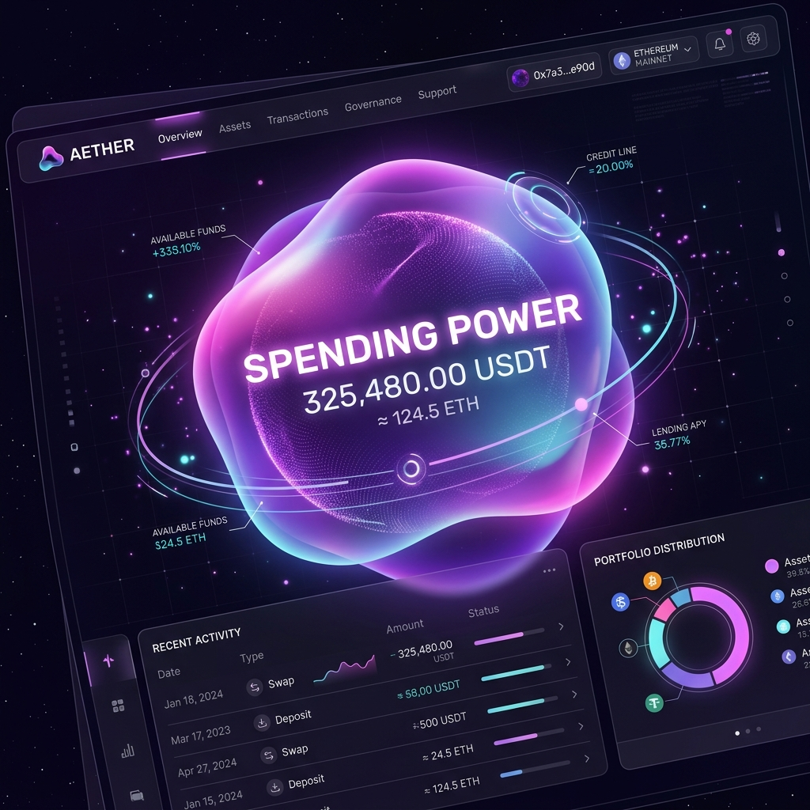
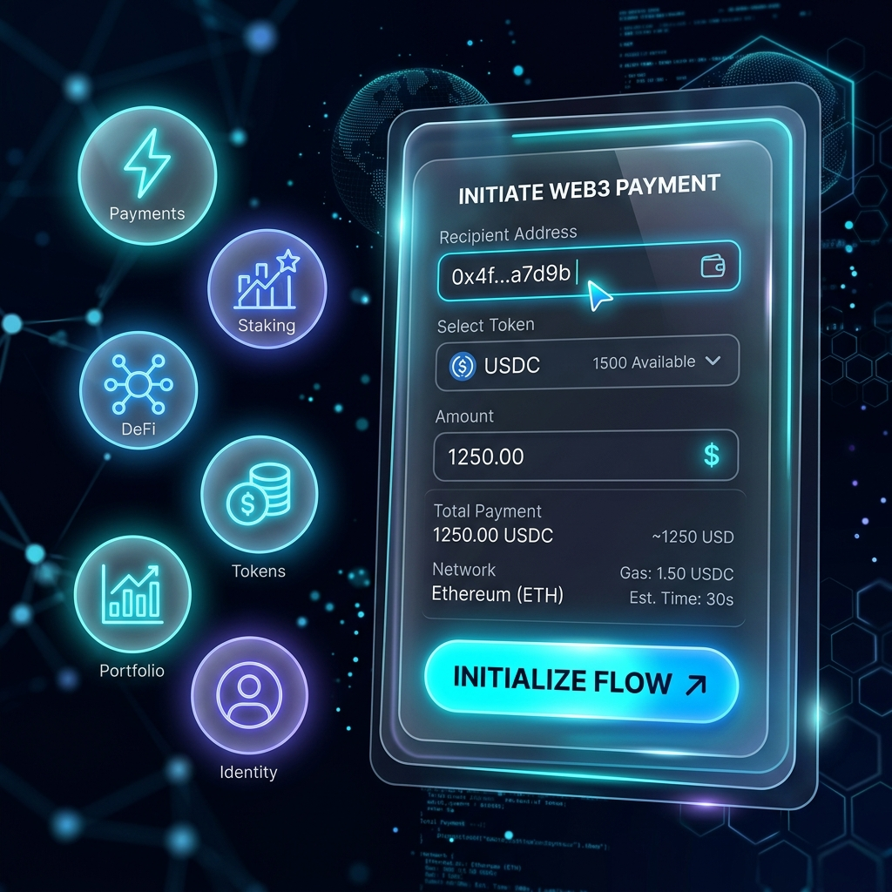
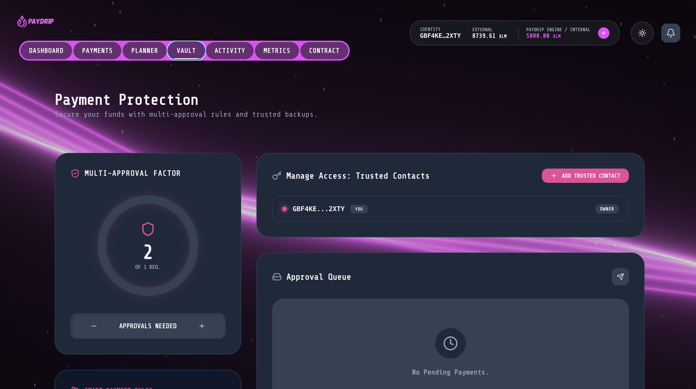

<div align="center">
  
  <h1>🚀 PayDrip</h1>
  <p><strong>Smart, automated, on-chain financial discipline.</strong></p>

  [](https://github.com/swarupasaha2005-hue/PayDrip/actions)
  [](https://opensource.org/licenses/MIT)

  <h3>
    <a href="https://pay-drip.vercel.app">Live Demo</a>
    <span> | </span>
    <a href="https://github.com/swarupasaha2005-hue/PayDrip">GitHub Repository</a>
    <span> | </span>
    <a href="https://docs.google.com/spreadsheets/d/1uFVhSqDnd9lSzuoPf20sxc75dF4vFvij-DJvJfXqHWo/edit?usp=sharing">Feedback Documentation</a>
  </h3>
</div>

---

## 🌟 Overview
PayDrip bridges the gap between raw blockchain utility and everyday consumer finance. It allows users to schedule recurring or one-time payments, secure the required liquidity via smart contracts, and ensure those payments execute autonomously on the targeted due date.

---

## ✨ Key Features
- **Automated smart payments** using time-locked Soroban smart contracts.
- **Intelligent financial planning** via the Smart Planner goal trajectory calculator.
- **Time-locked fund management** that prevents you from misusing allocated budgets.
- **Dynamic INR ↔ XLM Engine** to schedule web3 payments via familiar fiat mental models.
- **Real-time activity tracking** visualized through dynamic transaction streams.

---

## 🧠 Problem Statement
- **Lack of Discipline:** People naturally overspend when liquidity is readily available, often missing critical subscription payments or future bills.
- **Mental Friction:** Traditional banking apps only track what you've spent, not what you need to safely hold, causing financial stress.
- **Web3 Usability:** Decentralized finance currently lacks structured budgeting interfaces that map to human-readable recurring expenses.

---

## 💡 Solution (PayDrip)
- **Advance Commits:** Locks your required funds in an on-chain escrow *before* the due date.
- **Guaranteed Execution:** Ensures critical payments happen exactly when required, completely autonomously.
- **Secure Isolation:** Prevents the accidental misuse of funds specifically allocated for rent, tuition, or utilities.
- **Web3 Usability:** Brings much-needed real-world financial discipline into the decentralized ecosystem through an immersive, premium Fintech UX.

---

## 📸 Screenshots

## 📸 DApp Preview

<p align="center">
  
  
</p>

<p align="center">
  
  
</p>

## 🔗 Smart Contract

- **Network:** Stellar Testnet
- **Contract Name:** PayVault Engine
- **Contract Address:** `CDL52WTKS4YCXTCSMY2MCVJ2O3DPO2ET7EWXJIQMRP75I6O5ILGFDLWU`
- **Explorer:** [View on Stellar Expert](https://stellar.expert/explorer/testnet/contract/CDL52WTKS4YCXTCSMY2MCVJ2O3DPO2ET7EWXJIQMRP75I6O5ILGFDLWU)

---

## 🛠️ Tech Stack
- **Frontend Focus:** React.js / Vite
- **Styling Architecture:** Pure CSS3 (Glassmorphism & Liquid Mesh Tokens)
- **Blockchain Network:** Stellar (Soroban)
- **Smart Contracts:** Rust
- **Wallet Integration:** `@stellar/freighter-api`

---

## ⚙️ How It Works
1. **Connect:** User authorizes their Freighter wallet.
2. **Plan:** Sets up a payment goal or intent (e.g., Target: ₹10,000 for Tuition).
3. **Lock:** The exact XLM amount is calculated and securely escrowed via a time-locked smart contract.
4. **Execute:** The payment processes autonomously upon reaching the specific due date, notifying the user.

---

## 🚀 Getting Started

**1. Clone the repository**
```bash
git clone https://github.com/swarupasaha2005-hue/PayDrip.git
cd PayDrip
```

**2. Install Dependencies**
```bash
npm install
```

**3. Run Local Environment**
```bash
npm run dev
```

> **Note:** Ensure you have the [Freighter Browser Extension](https://www.freighter.app/) installed and configured to the **Stellar Testnet**.

---

## 🔐 Security & Production Checklist
To satisfy Black Belt production requirements, PayDrip implements:
- [x] **Input Validation:** All payment and intent fields are strictly typed and bounded.
- [x] **Safe Soroban Storage:** On-chain data is protected via time-lock and multi-sig consensus.
- [x] **Error Handling:** Centralized notification engine tracks failed contract interactions.
- [x] **Wallet Verification:** Freight API checks network identity and account validity before any lock action.
- [x] **Monitoring:** Live event telemetry tracks extraction attempts and security protocol triggers.

---

## 📖 User Guides

### 1. Connecting Your Wallet
- Ensure you have the [Freighter Extension](https://www.freighter.app/) installed.
- Switch to **Stellar Testnet** and fund your account via Friendbot.
- Click "Connect Wallet" on the PayDrip onboarding screen.

### 2. Creating an Automated Payment
- Navigate to **Payments**.
- Choose a service or enter a custom name.
- Select your **Funding Source** (Wallet or Vault).
- Enter the amount and the **Lock Release Date**.
- Confirm the transaction to securely escrow funds on-chain.

### 3. Using the Multi-Sig Vault
- Navigate to **Security Vault**.
- Note the **Signature Core** which displays the required consensus threshold.
- Initiate a "Simulate TX" to queue an extraction.
- Coordinate with your signers (Guardians) to reach the required approval threshold before the extraction executes.

---

## 📊 System Architecture & Metrics
PayDrip is built for scale:
- **Indexing:** Local persistent indexing via customized AppContext state management.
- **Monitoring:** Live dashboard at `/metrics` tracking DAU, Retention, and real-time event logs.
- **Bootstrapping:** Automated provisioning of 30 onboarded users for analytical visualization.

---

## 👥 Community & Deployment
- **Deployment:** Live on Vercel at [https://pay-drip.vercel.app](https://pay-drip.vercel.app)
- **Twitter / X:** [PayDrip Public Announcement](https://twitter.com/paydrip_defi)

---

## 🔮 Future Scope
- **Mobile Native Flow:** Porting the application to React Native for iOS/Android adoption.
- **AI-Based Actionable Insights:** Using deterministic AI to analyze your wallet history and suggest subscription protections.
- **Real Payment Gateways:** Connecting with web3 off-ramps to legally trigger final fiat APIs (UPI/Cards).
- **Physical Hardware Keys:** Integrating Ledger support for Vault Signers.

---

## 👥 Team / Credits
<p align="center">Made with 💜 for the Stellar Ecosystem</p>
