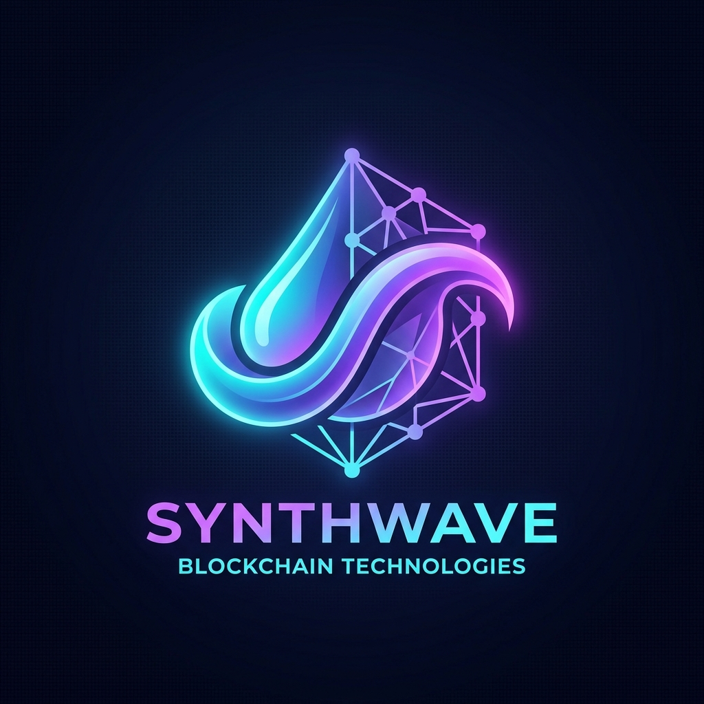
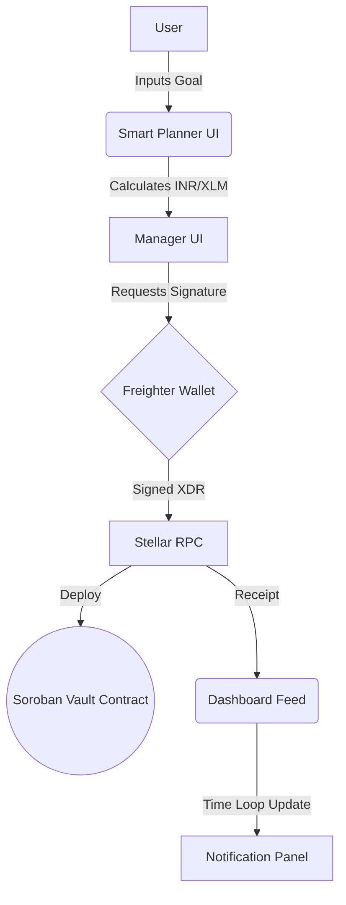

<div align="center">
  
  <h1>💧 PayDrip</h1>
  <p><strong>The Smart Financial Discipline Platform</strong></p>
  <p>Autonomous Payment Intents, AI Goal Planning, & Blockchain-backed Subscription Budgeting.</p>

  [](https://github.com/swarupasaha2005-hue/PayDrip/actions)
  [](https://opensource.org/licenses/MIT)
</div>

---
Github: https://github.com/swarupasaha2005-hue/PayDrip
Vercel: https://pay-drip.vercel.app/

## 🎯 1. Project Overview

**The Problem:** Managing subscription budgets (Netflix, Rent, Tuition) is messy. Traditional banking apps abstract away liquidity until the payment bounces. Decentralized finance applications often lack real-world usability because they don't map to human-readable financial services or local fiat currencies.

**The PayDrip Solution:** PayDrip is a **Smart Financial Discipline Platform**. It bridges the gap between raw blockchain utility and everyday consumer finance. Users can define a savings goal or upcoming expense, let AI compute a payment trajectory, and safely lock their required funds on the Stellar blockchain. When the due date hits, PayDrip executes the payment autonomously. It protects your budget by physically securing the liquidity required for your upcoming bills.

---

## ✨ 2. Key Features

- **💱 Dynamic INR ↔ XLM Engine:** Say goodbye to mental math. Type in your required amount in INR (₹) and instantly lock the exact XLM equivalent.
- **🔒 Smart Fund Locking:** Secure funds in a time-locked escrow contract. You literally cannot spend your specialized Netflix budget on a whim.
- **📅 Visual Payment Scheduling:** Map out your expenses (Rent, Spotify, Custom) and view them dynamically on a beautiful pipeline.
- **🔁 Autopay Simulation Loop:** Watch the platform track time and transition intents from *Locked* to *Paid* seamlessly on the designated due date.
- **🤖 AI Smart Plan Generator:** Feed our AI your savings target ("I need ₹10,000 in 3 months") and get an instant, deterministic weekly locking schedule applied straight to your dashboard.
- **🔔 Smart Notification Layer:** Integrated alerts that ping you when funds are secured and autonomously notify you exactly when a payment successfully executes.

---

## 🛠️ 3. How It Works (The User Flow)

1. **Calculate:** Open the *Smart Planner*, input your target in INR, and click "Apply Plan".
2. **Authorize:** Review the prepopulated Payment Intent form (Service, Amount, Frequency) and click *Setup Payment*.
3. **Lock:** Approve the transaction via your **Freighter Wallet**. The specified XLM is removed from your operational balance and locked into the `PayVault` Soroban Smart Contract.
4. **Monitor:** Track your upcoming payment from the *Dashboard* via time-coded status badges.
5. **Execute:** On the due date, the system auto-resolves the transaction via our background execution simulator, completing the cycle and generating a receipt.

---

## 💻 4. Tech Stack

- **Frontend Interface:** 
  - React 18 & React Router
  - Vite (Lightning-fast HMR & Builds)
  - CSS3 (Custom Glassmorphism & Tokenized Theming)
- **Blockchain Connectivity:**
  - `@stellar/stellar-sdk` (v15+)
  - `@stellar/freighter-api` (v6 Wallet Signature flows)
  - **Soroban** Smart Contracts (Rust)
- **DevOps & CI/CD:**
  - GitHub Actions (Automated Linting & Test Matrix)
  - Vercel (CD targeted)

---

## 🏗️ 5. System Architecture Flow



---

## 🚀 6. Setup Instructions

To get PayDrip running locally on your machine, follow these steps:

```bash
# 1. Clone the repository
git clone https://github.com/swarupasaha2005-hue/PayDrip.git
cd PayDrip

# 2. Install Dependencies
npm install

# 3. Run the Frontend (Localhost)
npm run dev

# 4. Run Contract Tests (Optional/Backend)
cd contract/contracts/pay-vault
cargo test
```

> **Note:** Make sure you have the [Freighter Browser Extension](https://www.freighter.app/) installed and set to the Stellar Testnet.

---

## ⚙️ 7. CI/CD & Code Quality

PayDrip implements an enterprise-grade CI/CD pipeline via GitHub Actions.

- **Lint Checks:** Every push triggers an ESLint validation step across the React codebase to enforce strict style and syntax rules.
- **Build Validation:** Vite attempts a production build (`npm run build`) in the runner to guarantee no dependency issues exist.
- **Contract Tests:** Rust unit tests for the Soroban smart contracts are run automatically upon modification to ensure on-chain logic remains bulletproof.

---

## 🖼️ 8. Platform Screenshots

*Note: Add high-resolution screenshots here prior to final submission.*

| Wallet & Onboarding | Dashboard & Intent Tracker |
| :---: | :---: |
|  |  |

| AI Smart Planner | Notifications Panel |
| :---: | :---: |
|  |  |

---

## 🏆 9. Why PayDrip is Unique

1. **Real-World Relativity:** Raw crypto balances mean nothing to everyday users. By prioritizing a **local fiat context** (INR) combined with familiar services (Netflix, Rent), PayDrip makes web3 feel like banking.
2. **Actionable AI:** We don't just use AI to chat; we use it to construct mathematical matrices for your goals and *auto-fill* the application interface to save you clicks.
3. **Financial Defense:** PayDrip isn't just for moving money; it’s designed to forcibly instill financial discipline by leveraging the immutability of blockchain escrows.

---

## 🌌 10. Future Scope

Our MVP proves the concept. Our roadmap proves the vision:

- **Real Payment Integration:** Connecting with off-ramps/oracles to actually trigger fiat APIs (UPI/Credit Cards) for the final subscription leg.
- **Multi-Currency Toggle:** Allow users to switch between USD, EUR, INR, and JPY conversion rates dynamically.
- **Group Payments:** Sub-vaults where multiple roommates can stream XLM towards a single Rent contract.
- **Advanced Predictive AI:** Analyzing wallet history to organically suggest subscriptions you might want to time-lock before you even ask.
- **Mobile Native Application:** Migrating our fluid responsive design into a standalone iOS/Android application.

---
<p align="center">Made with 💜 for the Stellar Ecosystem</p>
